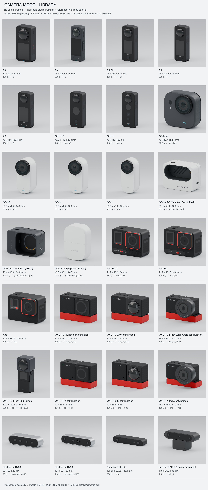

# Camera Model Library

Portable camera and accessory models for robotics, simulation, and visualization.
The library contains **25 camera configurations and 3 accessory configurations**,
with detailed visual meshes, lightweight convex collisions, URDF and MuJoCo
exports, and imaging parameter templates.



| Family | Model IDs |
| --- | --- |
| 360 cameras | `x6`, `x5`, `x4_air`, `x4`, `x3`, `one_x2`, `one_x` |
| Wearable cameras | `go_ultra`, `go3s`, `go3`, `go2` |
| Action cameras | `ace_pro2`, `ace_pro`, `ace` |
| Modular cameras | `one_rs_4k`, `one_rs_360`, `one_rs_1inch`, `one_rs_1inch360`, `one_r_4k`, `one_r_360`, `one_r_1inch` |
| Stereo and depth cameras | `realsense_d435i`, `realsense_d455`, `zed2i`, `oak_d` |
| Accessories | `go3_action_pod`, `go_ultra_action_pod`, `go2_charging_case` |

The [catalog](catalog/cameras.json) records manufacturer nominal dimensions,
mass, sources, and configuration limits. Exterior details and PBR materials are
independently modeled from product references. Fine geometry, mounting interfaces,
center of mass, and inertia remain estimates; imaging parameters are uncalibrated.

## Use the delivered assets

For another Python project, install the lightweight resolver and download only
the model you need:

```bash
python -m pip install https://github.com/TToTMooN/camera-assets/releases/download/v0.1.0/camera_assets-0.1.0-py3-none-any.whl
camera-assets fetch go3s --version v0.1.0
```

```python
from camera_assets import get_model

camera = get_model("go3s", version="v0.1.0")  # Offline lookup.
print(camera.urdf, camera.mjcf, camera.visual)
```

[Package usage](docs/PACKAGE.md) covers shared caches, local checkouts, pinned
versions, integrity checks, and calibration handling. Each release also provides
per-model ZIPs for applications that use other languages.

Copy the entire `models/<id>/` folder into your project and preserve its relative
paths. `model.json` identifies the visual, URDF, MJCF, and sensor manifest files.
The GLB embeds its visual materials and textures. URDF and MJCF provide geometry,
nominal mass, estimated inertia, and fixed placement references.

For example, [GO 3S](models/go3s/) includes a [GLB](models/go3s/assets/meshes/go3s_visual.glb),
[URDF](models/go3s/urdf/go3s.urdf), [MJCF](models/go3s/mjcf/go3s.xml), and
[sensor manifest](models/go3s/config/sensors.json).

Create and calibrate imaging sensors in your simulator separately. The
[simulation guide](docs/SIMULATION.md) covers Isaac Sim, MuJoCo, and Gazebo,
including optical frames, intrinsics, distortion, stereo/depth, and timing.
Camera bodies and accessories are separate assets; pods and cases are supplied
closed or folded, and modular camera configurations are rigid assemblies.

## Browse locally

Run from the repository root with Python 3.11 or later:

```bash
git clone https://github.com/TToTMooN/camera-assets.git
cd camera-assets
python -m venv .venv
source .venv/bin/activate
pip install -r requirements.txt
python scripts/viewer.py --list
python scripts/viewer.py --model go3s
```

Open [localhost:8080](http://127.0.0.1:8080/). Replace `go3s` with any model ID.
The viewer exposes visual meshes, collision geometry, and placement frames.

## Model layout

Each `models/<id>/` folder is self-contained:

| Path | Contents |
| --- | --- |
| `model.json` | Metadata and entry-point paths |
| `config/<id>.json` | Mechanical and geometry parameters |
| `config/sensors.json` | Per-imager calibration/mode templates, emitters, derived outputs, and backend records |
| `assets/meshes/<id>_visual.glb` | Visual model with embedded PBR materials and textures |
| `assets/meshes/<id>_visual.obj` and `.mtl` | Combined visual geometry and colors |
| `assets/meshes/visual/` | Material-separated visual meshes used by URDF/MJCF |
| `assets/meshes/collision/` | Convex collision meshes |
| `assets/visual_manifest.json` | Visual part and material mapping |
| `urdf/<id>.urdf` | Mechanical model and fixed reference frames |
| `mjcf/<id>.xml` | Default fixed mounted MuJoCo export |
| `preview/studio_hero.png`, `studio_back.png`, `studio_render.json` | GLB renders and their source hash/settings |
| `docs/validation.json` | Geometry validation results |

Mesh and simulator lengths are meters; mass is kilograms. The catalog stores
mechanical dimensions in millimeters. URDF/MJCF body axes are X depth, Y width,
and Z height, with a bottom placement origin. GLB is Y-up. Lens surface frames
are geometric references, and require measured optical poses for imaging.

## Validate

```bash
pip install -r requirements-sim.txt
python scripts/validate.py --model all --no-write
python scripts/sensor_manifest.py --model all --check
python -m unittest discover -s tests -v
```

Replace `all` with a model ID to check one asset. Tests cover geometry, portable
paths, sensor-manifest structure, and MuJoCo compilation and contact. Schema
validity does not certify optical calibration or a working imaging backend.
`--require-calibrated` intentionally fails for the shipped uncalibrated cameras.

## Regenerate assets

The delivered assets can be used without rebuilding. Mechanical source parameters
live in `catalog/cameras.json`; exterior details live in `scripts/appearance/`.
After changing a procedural model's source, run:

```bash
python scripts/build_assets.py --model go3s
python scripts/validate.py --model go3s
```

Builds refresh the fixed mounted MJCF and create missing sensor templates;
existing calibration files are preserved. For a free body, run
`python scripts/export_mjcf.py --model go3s --free` after building.

Studio rendering uses a separate Python 3.13 environment:

```bash
python3.13 -m venv .venv-blender
.venv-blender/bin/pip install -r requirements-blender.txt
.venv-blender/bin/python scripts/render_studio.py --model go3s --views hero back --size 900 --samples 48
python scripts/make_catalog_preview.py
```

After changing geometry, rerender its previews before composing the catalog;
the composer verifies each view against the current GLB hash. Use `--model all`
to build or render every configuration. `make_catalog_preview.py --software`
produces an optional geometry overview at a common physical scale.

X5 has a separate Blender source workflow in `scripts/x5/`:

```bash
.venv-blender/bin/python scripts/x5/build_model.py
python scripts/x5/build_urdf.py
python scripts/build_assets.py --model x5
```

Its editable source is [x5_source.blend](models/x5/assets/x5_source.blend).
The generic builder retains the delivered X5 visual. Rerender after rebuilding
its source, as for other models.

[Geometry and material notes](docs/APPEARANCE.md) describe exterior features,
previews, and accuracy limits. [Source notes](docs/SOURCES.md) document mechanical
references and specification discrepancies.

[MIT license](LICENSE). Independent models; not affiliated with the manufacturers.
