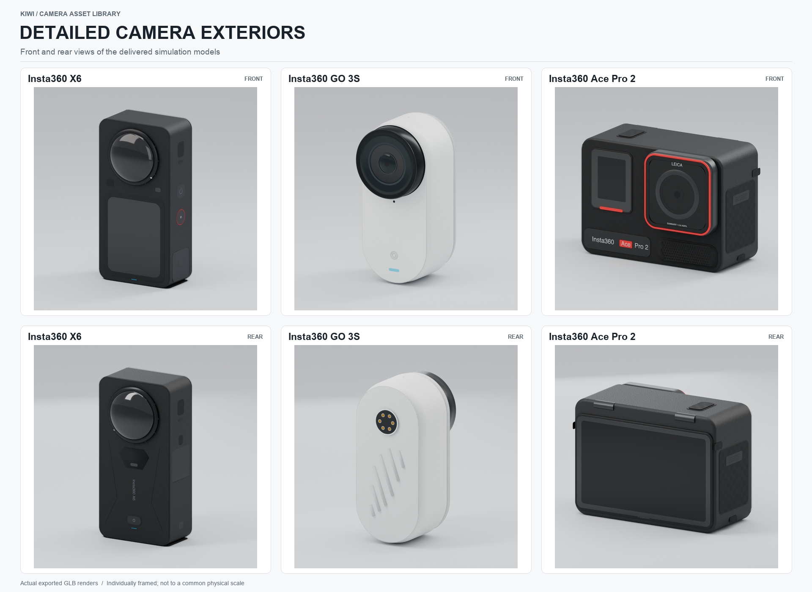

# Camera assets for KIWI

Portable camera geometry for robot layout, payload comparison, collision checks
and scene collection workflows. The catalog includes **28 configurations** across
X6, X5, X4 Air, X4, X3, ONE X2, ONE X; GO Ultra, GO 3S, GO 3, GO 2; Ace Pro 2,
Ace Pro, Ace; and ONE R / ONE RS lens configurations. GO Action Pods and the GO 2
Charging Case are separate accessories. RealSense D435i and D455, Stereolabs ZED 2i,
and the original Luxonis OAK-D enclosure cover depth and stereo hardware.


The X5 retains its detailed exterior model. The other 27 entries now use
reference-informed detailed exteriors with model-specific component layouts,
smooth edge bevels, layered optics, screens, controls, seals, contact pins and
vector markings. Manufacturer nominal dimensions and mass remain authoritative.
Plastic microtexture, molded grip, metal rings and coated glass use separate PBR
materials. Product photographs are references, not substituted model textures.
The [machine-readable catalog](catalog/cameras.json) records the source for each
published field and identifies estimated geometry.



Studio previews are rendered from the **delivered GLB itself** in Blender Cycles.
Each model has `preview/studio_hero.png` and `preview/studio_back.png`. Catalog
tiles use individual framing for inspection; use `--software` below for a
separate sheet at a common physical scale.

## View and build

```bash
git clone https://github.com/TToTMooN/insta360-urdf.git
cd insta360-urdf
python -m venv .venv
source .venv/bin/activate
pip install -r requirements.txt
python scripts/viewer.py --list
python scripts/viewer.py --model x6
```

Open [localhost:8080](http://127.0.0.1:8080/).

Generate and check the complete catalog, or replace `all` with a model ID:

```bash
python scripts/build_assets.py --model all
python scripts/validate.py --model all
python scripts/sensor_manifest.py --model all --check
python scripts/make_catalog_preview.py
```

Examples include `x6`, `x5`, `go3`, `go3s`, `go_ultra`, `ace_pro2` and
`one_rs_1inch360`, `realsense_d435i`, `realsense_d455`, `zed2i` and `oak_d`.
Use `viewer.py --list` for the full list.

For MuJoCo compilation, portable mesh loading and contact smoke tests:

```bash
pip install -r requirements-sim.txt
python -m unittest discover -s tests -v
```

`build_assets.py` keeps the existing detailed X5 visual. Its Blender rebuild
scripts remain `build_model.py` and `build_urdf.py`; install
`requirements-blender.txt` in a separate Python 3.13 environment for that workflow.
Building also refreshes the default mounted MJCF and creates missing sensor
parameter templates. Existing calibration files are preserved. Use
`export_mjcf.py --model <id> --free` after building for a free-body export.

The same separate Blender environment can render every delivered model:

```bash
python scripts/render_studio.py --model all --views hero back --size 900 --samples 48
python scripts/make_catalog_preview.py
# Optional: a second, geometrically rendered common-scale catalog
python scripts/make_catalog_preview.py --software
```

[Exterior modeling notes](docs/APPEARANCE.md) record the reference workflow,
model distinctions, material handling and remaining limits.

## Model files

Each entry lives in `models/<id>/`:

- `assets/meshes/<id>_visual.glb` and `.obj`: exterior geometry.
- `assets/meshes/collision/`: convex collision meshes.
- `urdf/insta360_<id>.urdf`: mass, estimated inertia, collision geometry and fixed frames.
- `mjcf/insta360_<id>.xml`: MuJoCo import artifact generated by `export_mjcf.py`.
- `config/<id>.json` and `docs/validation.json`: model parameters and validation results.
- `config/sensors.json`: per-imager calibration/mode template and separate emitter,
  panorama/depth and backend records. Unknown imaging parameters are `null`.

The historical `insta360_` filename prefix is retained for all brands for compatibility.

MJCF exports default to a fixed mounted root. Add `--free` for a free body. Exports
contain geometry, mass and fixed frame sites; scenes, lighting and imaging sensors
are supplied by the simulator integration.

Keep the folder layout when moving URDF or MJCF assets. Mesh and simulator units
are meters; the catalog stores millimeters and kilograms. URDF coordinates are
X = depth, Y = width and Z = height, with the origin at the bottom mounting
reference. GLB uses Y-up; the viewer converts it.

[KIWI integration notes](docs/KIWI.md) explain the intended use and frame limits.
[Simulator and imaging parameters](docs/SIMULATION.md) cover Isaac Sim, MuJoCo and
Gazebo integration, coordinate conversions and the remaining calibration work.
Lens surface frames are geometric references; optical centers, intrinsics,
distortion and camera response are uncalibrated. Mass distribution, small
features, mounts and controls remain estimates. Separate accessories are supplied
in the listed closed or folded pose; docked and articulated assemblies are not
included.

Check template structure with `sensor_manifest.py --model all --check`. Adding
`--require-calibrated` deliberately fails for the shipped uncalibrated imaging
devices; schema validity does not certify image generation or a simulator backend.
Studio catalogs verify each view's current GLB hash and render record. After
changing geometry, rerender its hero/back views before regenerating the catalog.

## Detailed X5 reference

<p align="center">
  
</p>


[GLB](models/x5/assets/meshes/x5_visual.glb) · [OBJ](models/x5/assets/meshes/x5_visual.obj) · [URDF](models/x5/urdf/insta360_x5.urdf) · [Blender source](models/x5/assets/x5_source.blend)

Independent geometry based on [official references](docs/SOURCES.md).
[MIT license](LICENSE); not affiliated with the camera manufacturers.
